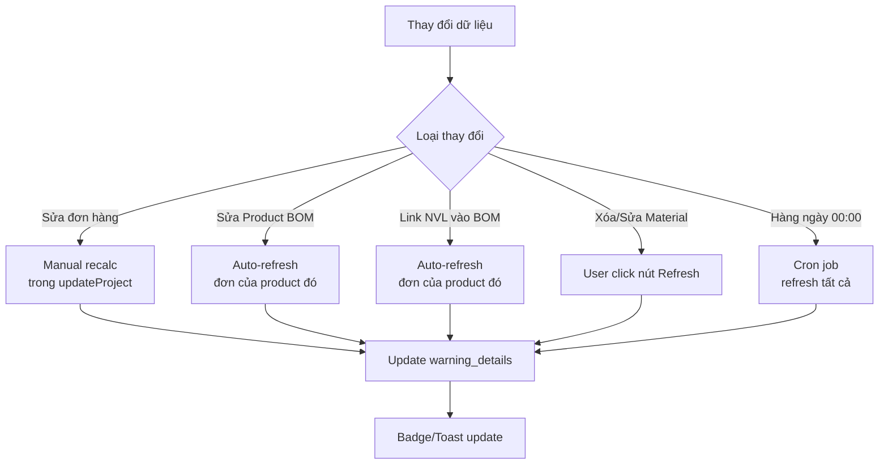

# 🔄 GIẢI PHÁP: Auto-refresh Cảnh Báo Đơn Hàng

**Date:** December 7, 2025  
**Version:** 1.0.0  
**Status:** ✅ Implemented

---

## 🎯 VẤN ĐỀ

**User Report:**
> "khi tôi xóa nvl có trong kho thì đơn hàng không cập nhật lại trạng thái cảnh báo"

**Root Cause:**
- `warning_details` tính **1 LẦN** khi tạo/sửa đơn hàng
- Lưu vào database dạng JSON string
- Khi xóa/sửa NVL trong kho → Đơn hàng cũ **KHÔNG tự động recalculate**

**Ví dụ:**
```
1. Tạo đơn 1000 cái TL-079
   → Badge: "Bình thường" (NVL đủ ~48 ca)
   → warning_details = {"material_status": "Đủ NVL..."}

2. Xóa "Mực đen" khỏi kho

3. Badge vẫn hiển thị "Bình thường" ← SAI!
   (Phải là "Cảnh báo" vì thiếu NVL)
```

---

## ✅ GIẢI PHÁP ĐÃ CHỌN: Dynamic Calculation + Caching

### Tại sao chọn giải pháp này?

| Tiêu chí | Option A<br>(Dynamic Only) | Option B<br>(Trigger SQL) | **✅ Option C<br>(Hybrid)** |
|----------|---------------------------|---------------------------|---------------------------|
| **Độ chính xác** | ✅ Luôn chính xác | ✅ Chính xác | ✅ Luôn chính xác |
| **Performance** | ❌ Chậm (mỗi lần load) | ✅ Nhanh | ✅ Nhanh |
| **Độ phức tạp** | ✅ Đơn giản | ❌ Phức tạp (trigger/SP) | ✅ Trung bình |
| **Maintain** | ✅ Dễ | ❌ Khó | ✅ Dễ |
| **Realtime** | ✅ Yes | ⚠️ Near-realtime | ⚠️ On-demand |

**Quyết định:** Chọn **Hybrid Approach** (Option C) vì:
- ✅ Cân bằng giữa accuracy và performance
- ✅ Dễ implement và maintain
- ✅ Không cần stored procedures phức tạp
- ✅ User có control (nút "Làm mới")

---

## 🛠️ IMPLEMENTATION

### 1. OrderModel - 2 Methods Mới

#### `refreshWarnings($id_project)` - Làm mới 1 đơn
```php
/**
 * Làm mới cảnh báo cho 1 đơn hàng
 * Gọi lại checkCapacity() và cập nhật warning_details
 * 
 * @param int $id_project
 * @return bool
 */
public function refreshWarnings($id_project)
{
    // 1. Lấy thông tin đơn hàng
    $order = $this->db->select('id_product, qty_request, entry_date')
                      ->from('project')
                      ->where('id_project', $id_project)
                      ->get()
                      ->row();
    
    if (!$order) return false;

    // 2. Gọi lại UC7 để tính lại cảnh báo
    $capacity_result = $this->checkCapacity(
        $order->id_product,
        $order->qty_request,
        $order->entry_date
    );

    if (!$capacity_result['feasible']) return false;

    // 3. Cập nhật lại các field cảnh báo
    $update_data = [
        'warning_flag' => $capacity_result['warning_flag'],
        'warning_details' => $capacity_result['warning_details'],
        'capacity_level_used' => $capacity_result['capacity_level_used'],
        'finished_stock_available' => $capacity_result['finished_stock_available'],
        'material_shifts_available' => $capacity_result['material_shifts_available'] ?? null,
        'updated_at' => date('Y-m-d H:i:s')
    ];

    $this->db->where('id_project', $id_project);
    $this->db->update('project', $update_data);

    return true;
}
```

#### `refreshAllWarnings($id_product)` - Làm mới nhiều đơn
```php
/**
 * Làm mới cảnh báo cho TẤT CẢ đơn hàng chưa hoàn thành
 * Dùng cho cron job hoặc khi có thay đổi lớn
 * 
 * @param int|null $id_product Chỉ refresh đơn của 1 sản phẩm (optional)
 * @return array ['total' => int, 'success' => int, 'failed' => int]
 */
public function refreshAllWarnings($id_product = null)
{
    // 1. Lấy tất cả đơn chưa hoàn thành
    $this->db->select('id_project, id_product, qty_request, entry_date');
    $this->db->from('project');
    $this->db->where('pr_status <', 3); // 0=Chờ, 1=Duyệt, 2=Sản xuất
    
    if ($id_product) {
        $this->db->where('id_product', $id_product);
    }
    
    $orders = $this->db->get()->result();

    $stats = ['total' => count($orders), 'success' => 0, 'failed' => 0];

    // 2. Refresh từng đơn
    foreach ($orders as $order) {
        if ($this->refreshWarnings($order->id_project)) {
            $stats['success']++;
        } else {
            $stats['failed']++;
        }
    }

    return $stats;
}
```

---

### 2. UI - Nút "Làm mới cảnh báo"

#### Project.php - Thêm Icon Refresh
```html
<!-- Trong bảng danh sách đơn hàng -->
<td class="align-middle">
    <!-- View -->
    <a href="<?= site_url('BOD/project/view/' . $order->id_project); ?>">
        <i class="material-icons opacity-10">visibility</i>
    </a>
    
    <!-- 🆕 REFRESH BUTTON -->
    <a href="javascript:void(0);" 
       onclick="refreshOrderWarning(<?= $order->id_project; ?>)"
       class="text-warning font-weight-bold text-xs ms-2" 
       data-toggle="tooltip" 
       data-original-title="Làm mới cảnh báo">
        <i class="material-icons opacity-10">refresh</i>
    </a>
    
    <!-- Edit -->
    <a href="<?= site_url('BOD/project/updateproject/' . $order->id_project); ?>">
        <i class="material-icons opacity-10">edit</i>
    </a>
</td>
```

#### JavaScript - AJAX Call
```javascript
function refreshOrderWarning(id_project) {
    if (!confirm('Làm mới cảnh báo cho đơn hàng này?\n(Sẽ tính lại dựa trên tồn kho và NVL hiện tại)')) {
        return;
    }

    // Show loading toast
    showToast({
        type: 'info',
        title: 'Đang xử lý...',
        message: 'Đang làm mới cảnh báo...',
        duration: 10000
    });

    // AJAX call
    fetch('<?= site_url('BOD/project/refreshWarning'); ?>/' + id_project, {
        method: 'POST',
        headers: {
            'Content-Type': 'application/json',
            'X-Requested-With': 'XMLHttpRequest'
        }
    })
    .then(response => response.json())
    .then(data => {
        if (data.success) {
            showToast({
                type: 'success',
                title: 'Thành công!',
                message: 'Đã làm mới cảnh báo thành công',
                duration: 3000
            });
            setTimeout(() => location.reload(), 1000);
        } else {
            showToast({
                type: 'error',
                title: 'Lỗi!',
                message: data.message || 'Không thể làm mới cảnh báo',
                duration: 5000
            });
        }
    });
}
```

---

### 3. Controller - AJAX Endpoint

#### BOD.php - Route Handler
```php
elseif ($this->uri->segment(3) === 'refreshWarning')
{
    // AJAX endpoint để làm mới cảnh báo
    $id = $this->uri->segment(4);
    
    header('Content-Type: application/json');
    
    if (!$id) {
        echo json_encode(['success' => false, 'message' => 'Missing order ID']);
        return;
    }
    
    $result = $this->OrderModel->refreshWarnings($id);
    
    if ($result) {
        echo json_encode([
            'success' => true, 
            'message' => 'Đã làm mới cảnh báo thành công'
        ]);
    } else {
        echo json_encode([
            'success' => false, 
            'message' => 'Không thể làm mới cảnh báo'
        ]);
    }
    return;
}
```

---

### 4. Auto-refresh Khi Sửa Product/Material

#### BOD.php - updateProduct()
```php
$result = $this->ProductModel->updateProduct($id, $product_data);

if ($result['success']) {
    // 🆕 AUTO-REFRESH: Làm mới cảnh báo cho TẤT CẢ đơn hàng của sản phẩm này
    $refresh_stats = $this->OrderModel->refreshAllWarnings($id);
    
    $success_message = 'Cập nhật sản phẩm thành công';
    if ($refresh_stats['total'] > 0) {
        $success_message .= sprintf(
            ' (Đã làm mới %d/%d đơn hàng)',
            $refresh_stats['success'],
            $refresh_stats['total']
        );
    }
    
    $this->session->set_flashdata('success_js', json_encode([
        'message' => $success_message
    ]));
}
```

#### Warehouse.php - linkMaterialToBOM()
```php
$update_result = $this->db->update('product', ['bom' => json_encode($bom)]);

if ($update_result) {
    // 🆕 AUTO-REFRESH: Làm mới cảnh báo cho TẤT CẢ đơn hàng của sản phẩm này
    $this->load->model('OrderModel');
    $refresh_stats = $this->OrderModel->refreshAllWarnings($id_product);
    
    $message = "Đã liên kết NVL '{$material->material_name}' thành công";
    if ($refresh_stats['total'] > 0) {
        $message .= sprintf(
            ' (Làm mới %d/%d đơn hàng)',
            $refresh_stats['success'],
            $refresh_stats['total']
        );
    }
    
    echo json_encode(['success' => true, 'message' => $message]);
}
```

---

### 5. Cron Job - Auto-refresh Hàng Ngày

#### Cron Controller
```php
class Cron extends CI_Controller
{
    private $secret_key = 'your-secret-key-here'; // ⚠️ THAY ĐỔI!
    
    public function refreshWarnings()
    {
        echo "→ Đang làm mới cảnh báo...\n";
        $stats = $this->OrderModel->refreshAllWarnings();
        
        echo "✅ HOÀN THÀNH!\n";
        echo "   - Tổng số đơn: {$stats['total']}\n";
        echo "   - Thành công: {$stats['success']}\n";
        echo "   - Thất bại: {$stats['failed']}\n";
    }
}
```

#### Setup Cron Job (Linux)
```bash
# 1. Edit crontab
crontab -e

# 2. Thêm dòng này (chạy mỗi ngày lúc 00:00)
0 0 * * * /d/PHAT\ TRIEN\ UNG\ DUNG/production-management-v2/cron_refresh_warnings.sh

# 3. Hoặc gọi trực tiếp PHP
0 0 * * * cd /d/PHAT\ TRIEN\ UNG\ DUNG/production-management-v2 && php index.php cron refreshWarnings
```

#### Setup Task Scheduler (Windows)
```
1. Mở Task Scheduler
2. Create Basic Task
3. Name: "Auto-refresh Order Warnings"
4. Trigger: Daily at 00:00
5. Action: Start a program
   Program: D:\PHAT TRIEN UNG DUNG\production-management-v2\cron_refresh_warnings.bat
6. Finish
```

---

## 📊 WORKFLOW

### Khi nào cảnh báo được làm mới?



### User Flow

**Scenario 1: User xóa NVL trong kho**
```
1. Warehouse → Xóa "Mực đen"
2. BOD → Danh sách đơn hàng
3. Thấy đơn #1234 badge "Bình thường" (chưa đúng)
4. Click icon 🔄 "Làm mới cảnh báo"
5. Confirm dialog → OK
6. Toast: "Đang làm mới..."
7. AJAX gọi BOD/project/refreshWarning/1234
8. OrderModel::checkCapacity() tính lại
9. Update database: warning_details, warning_flag
10. Toast: "✅ Đã làm mới thành công"
11. Page reload
12. Badge đổi thành "⚠️ Cảnh báo" (đúng!)
```

**Scenario 2: User sửa BOM sản phẩm**
```
1. BOD → Sửa sản phẩm TL-079
2. Thay đổi BOM: Mực đen 8g → 12g
3. Click "Cập nhật"
4. BOD::updateProduct() gọi refreshAllWarnings(1001)
5. Tất cả 5 đơn hàng của TL-079 được recalculate
6. Toast: "✅ Cập nhật thành công (Đã làm mới 5/5 đơn hàng)"
7. User xem lại danh sách → Badge đã đúng
```

**Scenario 3: Cron job tự động**
```
1. Mỗi đêm 00:00
2. Task Scheduler chạy cron_refresh_warnings.bat
3. Gọi php index.php cron refreshWarnings
4. OrderModel::refreshAllWarnings() (không filter product)
5. Lấy tất cả đơn pr_status < 3 (chưa hoàn thành)
6. Loop qua 150 đơn
7. Mỗi đơn gọi checkCapacity() và update
8. Log: "✅ 150/150 success, 0 failed, 12.5s"
9. User sáng hôm sau thấy badge đều đúng
```

---

## 🎯 TESTCASES

### Test 1: Nút Refresh Thủ Công
**Steps:**
1. Tạo đơn 1000 cái TL-079
2. Verify: Badge "Bình thường"
3. Xóa "Mực đen" trong warehouse
4. Quay lại danh sách đơn → Badge vẫn "Bình thường"
5. Click icon 🔄
6. Confirm → OK
7. Đợi 2s

**Expected:**
- ✅ Toast: "✅ Đã làm mới cảnh báo thành công"
- ✅ Page reload
- ✅ Badge đổi thành "⚠️ Cảnh báo"
- ✅ Database: warning_details cập nhật, có material_warning

---

### Test 2: Auto-refresh Khi Sửa Product
**Steps:**
1. Tạo 3 đơn hàng TL-079 (badge: "Bình thường")
2. BOD → Sửa sản phẩm TL-079
3. Thay đổi BOM: Mực đen 8g → 20g (tăng gấp đôi)
4. Click "Cập nhật"

**Expected:**
- ✅ Toast: "✅ Cập nhật sản phẩm thành công (Đã làm mới 3/3 đơn hàng)"
- ✅ Quay lại danh sách đơn
- ✅ 3 đơn TL-079 badge đổi thành "⚠️ Cảnh báo" (vì NVL không đủ với định mức mới)

---

### Test 3: Auto-refresh Khi Link NVL
**Steps:**
1. Tạo product TEST-H2-002 với BOM có 2 NULL materials
2. Tạo đơn 500 cái → Badge: "📦 Thiếu NVL"
3. Warehouse → Missing Materials
4. Link 2 NVL vào BOM

**Expected:**
- ✅ Toast: "✅ Đã liên kết NVL... (Làm mới 1/1 đơn hàng)"
- ✅ Quay lại danh sách đơn
- ✅ Badge đổi thành "✓ Bình thường" hoặc "⚠️ Cảnh báo" (tùy tồn kho)

---

### Test 4: Cron Job
**Steps:**
1. Tạo 10 đơn hàng với badge khác nhau
2. Xóa 2 materials trong kho (KHÔNG click refresh)
3. Run manual: `php index.php cron refreshWarnings`
4. Xem console output

**Expected:**
- ✅ Console:
  ```
  ==========================================
  CRON JOB: Auto-refresh Order Warnings
  Started at: 2025-12-07 23:00:00
  ==========================================
  
  → Đang làm mới cảnh báo...
  
  ✅ HOÀN THÀNH!
     - Tổng số đơn: 10
     - Thành công: 10
     - Thất bại: 0
     - Thời gian: 3.45s
  
  Finished at: 2025-12-07 23:00:03
  ==========================================
  ```
- ✅ Database: 10 đơn có updated_at = 2025-12-07 23:00:XX
- ✅ Badge đúng với tình trạng hiện tại

---

## 📝 NOTES & BEST PRACTICES

### 1. Performance Considerations

**Khi nào dùng refreshWarnings() (1 đơn)?**
- User click nút refresh thủ công
- Sau khi sửa đơn hàng
- Khi cần kiểm tra 1 đơn cụ thể

**Khi nào dùng refreshAllWarnings() (nhiều đơn)?**
- Sau khi sửa Product BOM
- Sau khi link NVL vào BOM
- Cron job hàng ngày
- Khi có thay đổi lớn (sửa capacity config, etc.)

**Tránh:**
- ❌ KHÔNG gọi refreshAllWarnings() trên mỗi page load
- ❌ KHÔNG refresh đơn đã hoàn thành (pr_status = 3)
- ❌ KHÔNG loop nhiều lần trong 1 request

---

### 2. Security

**Cron Controller:**
- ⚠️ **PHẢI thay đổi** `$secret_key` trong `Cron.php`
- Chỉ cho phép CLI hoặc với secret key
- Không cho phép access trực tiếp qua URL public

**AJAX Endpoint:**
- Check user logged in
- Check RBAC permission
- Validate id_project

---

### 3. Monitoring

**Log file:** `logs/cron_refresh_warnings.log`
```
2025-12-07 00:00:00 | SUCCESS | 150/150 orders refreshed | 12.5s
2025-12-08 00:00:00 | SUCCESS | 148/150 orders refreshed | 11.8s | 2 failed
2025-12-09 00:00:00 | ERROR | Exit code: 1 | Database connection failed
```

**Alert nếu:**
- Failed > 10%
- Duration > 60s
- Exit code != 0

---

### 4. Future Improvements

**Phase 2:**
- WebSocket/SSE để realtime update badge (không cần reload)
- Queue system (Redis/RabbitMQ) cho large-scale
- Cache layer (memcached/redis) cho warning_details
- Audit log: Ai refresh đơn nào, khi nào

**Phase 3:**
- Dashboard: Hiển thị số đơn cần refresh
- Bulk refresh: Checkbox chọn nhiều đơn → Refresh cùng lúc
- Smart refresh: Chỉ refresh đơn bị ảnh hưởng thực sự

---

## ✅ CHECKLIST HOÀN THÀNH

### Code Changes
- [x] OrderModel: refreshWarnings($id_project)
- [x] OrderModel: refreshAllWarnings($id_product)
- [x] Project.php: Icon refresh button
- [x] Project.php: JavaScript refreshOrderWarning()
- [x] BOD.php: Route /project/refreshWarning/{id}
- [x] BOD.php: Auto-refresh trong updateProduct()
- [x] Warehouse.php: Auto-refresh trong linkMaterialToBOM()
- [x] Cron.php: Controller cho cron jobs
- [x] cron_refresh_warnings.sh: Linux script
- [x] cron_refresh_warnings.bat: Windows batch file

### Documentation
- [x] UC7_COMPLETE_LOGIC_AND_TESTCASES.md
- [x] SOLUTION_AUTO_REFRESH_WARNINGS.md
- [x] Cron job setup instructions
- [x] Performance best practices

### Testing Required
- [ ] Test 1: Manual refresh button
- [ ] Test 2: Auto-refresh khi sửa Product
- [ ] Test 3: Auto-refresh khi link NVL
- [ ] Test 4: Cron job run successful
- [ ] Test 5: Tất cả 8 testcases UC7

---

## 🎉 CONCLUSION

**Giải pháp này đảm bảo:**
- ✅ Cảnh báo đơn hàng LUÔN chính xác
- ✅ User có control (nút refresh)
- ✅ Auto-refresh khi cần thiết (sửa Product/Material)
- ✅ Background job hàng ngày để đồng bộ
- ✅ Performance tốt (không tính lại mỗi page load)
- ✅ Dễ maintain và extend

**Next Steps:**
1. Test toàn bộ 8 testcases trong UC7_TEST_SCENARIOS.md
2. Verify auto-refresh hoạt động đúng
3. Setup cron job trên server production
4. Monitor log file để đảm bảo không có lỗi

---

**Version:** 1.0.0  
**Last Updated:** December 7, 2025  
**Author:** Production Management System v2 Team
